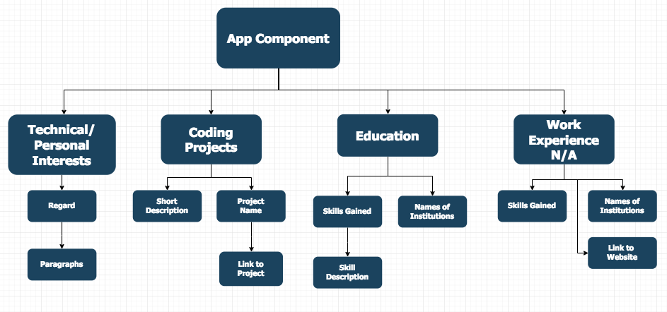

# _React Portfolio_

#### _Landing page for programming portfolio, Oct.12 2018_

#### By _**Brown, J. Michael**_

## Description

_This is the Landing page for all projects I will show to my teachers. At some point in the future, it may also be shown to employers._

## Component Structure

## Setup/Installation Requirements

 _1. Open your terminal (command+spacebar on homepage for mac, to search for "terminal")_

 _2. Navigate to your desktop (input "cd ~" to go to home directory then "cd desktop" to move to desktop)_

 _3. Copy url for a clone (located top right of listed files in green)_

 _4. Clone onto Desktop (type "git clone <url link>")_

 _5. Open website in a browser (double click the "React-Portfolio" file on your desktop then double click the "index.html" file)_

* _Or open the page at this url: https://j-michael-brown.github.io/React-Portfolio/_

_Requires git to be downloaded on your devise to use instructed git terminal commands._

## Known Bugs

_No known bugs yet. Contact me via email if you would like to report any._

## Support and contact details

_If you run into any issues or have questions, ideas or concerns, or if you want to make a contribution to the code. You can email me @jmichaelbrown132737@gmail.com_

## Technologies Used

_Utilizes Bootstrap.css_

### License

*MIT license*

Copyright (c) 2018 **_{John Michael Brown}_**
