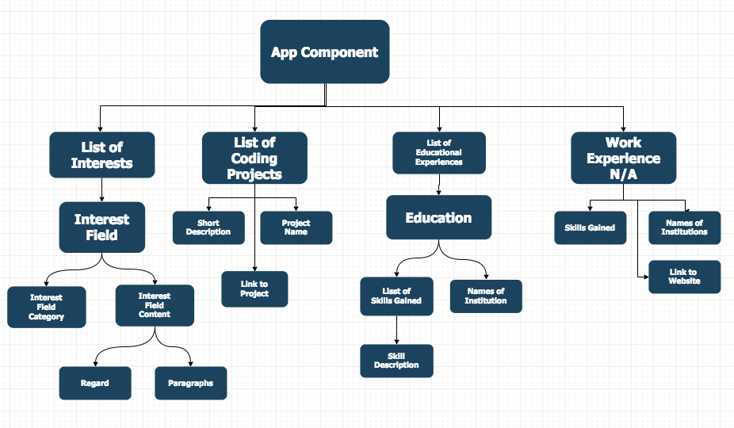

# React Portfolio

_My Portfolio made with REACT._

### Developed By
J. Michael Brown

## Table of contents
**[Description](#description)**    
**[Setup & Installation](#setup-and-installation)**    
**[Known Bugs](#known-bugs)**    
**[Support](#support-and-contact-details)**    
**[Technologies Used](#technologies-used)**    
**[License](#license)**    
**[Copyright](#copyright)**   
**[Dev Notes](#developer-notes)**   
**[Component Structure](#component-structure)**   

## Description

Information about myself, including: my projects on Git, my personal and technical interests, along with my educational history.

## Setup and Installation
Here are some links in case you need information about setup for other operating systems:  
[Node JS](https://nodejs.org/en/);

(If you cannot install node you still need to install Git's [Homebrew](https://brew.sh/) on your device)

## Known Bugs

* No bugs yet, I'll get some soon

## Support and contact details
_If you run into any issues or have questions, ideas or concerns, or if you want to make a contribution to the code. You can email me_

Michael Brown :: [jmichaelbrown132737@gmail.com](jmichaelbrown132737@gmail.com)

## Technologies Used
(This wonderful table was lovingly pilfered from [Tanvi Garg](https://github.com/TanviCodeLife) and modestly edited for personal sensibilities.)

For versions and a full list of dependencies, plugins, and scripts see the "devDependencies" section in [package.json](./package.json).  

| Dependency | Description |
| --- | --- |
| react | REACT core plugin |
| react-router-dom | REACT web routing plugin |
| babel-core | Babel compiler core |
| babel-loaded | Babel loader for webpack |
| babel-present-es2015 | Specifies how Babel can convert ES6 to ES5 |
| eslint | Identifies and reports on patterns found in Javscript code |
| eslint-loader | ESLint loader for webpack |
| html-webpack-plugin | Simplifies creation of HTML files to serve webpack bundles |
| webpack | A module bundler used to bundle JavaScript files and additional resources   *Note - Remove carrot sign ^ in version number if webpack issues occur* |
| webpack-cli | Use webpack from command line |
| webpack-dev-server | Provides live reloading during development |

### License

MIT License

Copyright (c) 2018, ___J. Michael Brown___  

Permission is hereby granted, free of charge, to any person obtaining a copy
of this software and associated documentation files (the "Software"), to deal
in the Software without restriction, including without limitation the rights
to use, copy, modify, merge, publish, distribute, sublicense, and/or sell
copies of the Software, and to permit persons to whom the Software is
furnished to do so, subject to the following conditions:  

The above copyright notice and this permission notice shall be included in all
copies or substantial portions of the Software.

THE SOFTWARE IS PROVIDED "AS IS", WITHOUT WARRANTY OF ANY KIND, EXPRESS OR
IMPLIED, INCLUDING BUT NOT LIMITED TO THE WARRANTIES OF MERCHANTABILITY,
FITNESS FOR A PARTICULAR PURPOSE AND NONINFRINGEMENT. IN NO EVENT SHALL THE
AUTHORS OR COPYRIGHT HOLDERS BE LIABLE FOR ANY CLAIM, DAMAGES OR OTHER
LIABILITY, WHETHER IN AN ACTION OF CONTRACT, TORT OR OTHERWISE, ARISING FROM,
OUT OF OR IN CONNECTION WITH THE SOFTWARE OR THE USE OR OTHER DEALINGS IN THE
SOFTWARE.

## Developer Notes    
README.md template provided by [Ralph Perdomo](https://github.com/pseudoralph)

looking into implementing components/libraries - 'react-toolbox/io/#/'

## Component Structure

